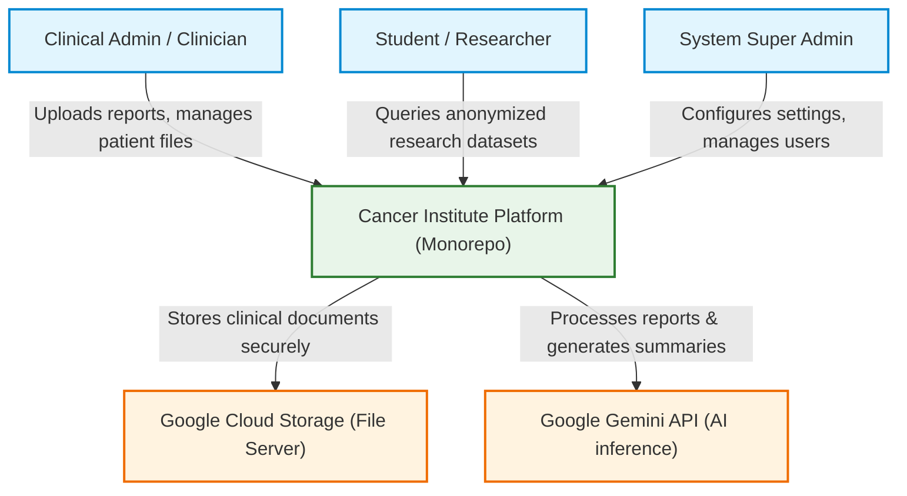
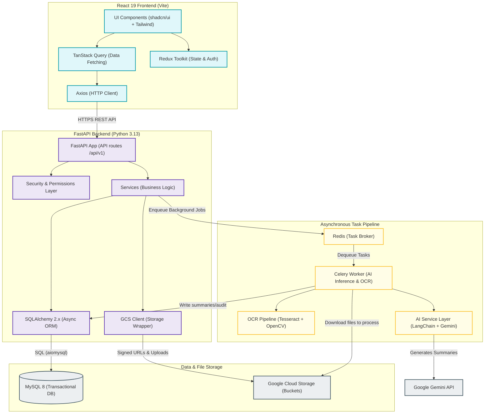
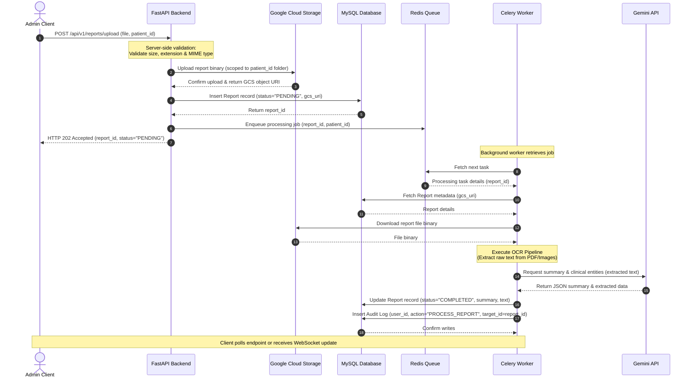

# System Architecture — Cancer Institute Platform

This document describes the high-level architecture, system components, and key request lifecycles of the Cancer Institute Management & AI Research Platform.

---

## 1. System Context Diagram

The following diagram shows the boundary of the platform and how different user roles and external services interact with it.

---

## 2. Component Diagram

The platform utilizes a monorepo structure separating the React 19 Frontend and the FastAPI Backend, with Celery processing long-running workloads asynchronously via Redis.

---

## 3. Request Lifecycle: Medical Report Upload & AI Processing

The sequence diagram below details the end-to-end lifecycle when a clinical administrator uploads a medical report. The API returns an immediate `202 Accepted` status, while the OCR extraction and AI clinical summarization run in the background.

