# Entity Relationship Diagram — Cancer Institute Platform

The database schema is designed for MySQL 8, utilizing soft-delete capabilities, audit logging, role-based authorization, and polymorphic treatment logging via structured JSON fields.

## Mermaid ER Diagram

```mermaid
erDiagram
    %% Core Identity & Patient Entities
    USERS {
        int id PK
        string email UK
        string hashed_password
        string role "super_admin | admin | student"
        string status "active | deactivated"
        datetime created_at
        datetime updated_at
        datetime deleted_at
    }

    PATIENTS {
        int id PK
        string mrn UK
        string first_name
        string last_name
        date birth_date
        string gender "M | F | O"
        string status "active | inactive | deceased"
        datetime created_at
        datetime updated_at
        datetime deleted_at
    }

    PATIENT_CONTACTS {
        int id PK
        int patient_id FK
        string contact_name
        string relationship
        string phone
        string email
        string address
        datetime created_at
        datetime updated_at
        datetime deleted_at
    }

    %% Clinical Records
    MEDICAL_HISTORY {
        int id PK
        int patient_id FK
        text conditions "JSON array of co-morbidities"
        text surgeries "JSON array of past surgeries"
        text family_history "JSON object"
        text allergies "JSON array"
        datetime created_at
        datetime updated_at
        datetime deleted_at
    }

    CANCER_STAGES {
        int id PK
        string system "TNM | FIGO | AnnArbor"
        string t_stage "T0-T4"
        string n_stage "N0-N3"
        string m_stage "M0-M1"
        string group_stage "I-IV"
        int staged_by FK "Doctor User ID"
        datetime created_at
        datetime updated_at
        datetime deleted_at
    }

    DIAGNOSES {
        int id PK
        int patient_id FK
        string primary_site
        string histology
        date diagnosis_date
        int staging_id FK
        datetime created_at
        datetime updated_at
        datetime deleted_at
    }

    TREATMENTS {
        int id PK
        int patient_id FK
        string type "surgery | chemo | radiation | immunotherapy | targeted"
        string status "scheduled | ongoing | completed | suspended"
        date start_date
        date end_date
        int doctor_id FK "Doctor User ID"
        text details "JSON containing treatment-specific metadata"
        datetime created_at
        datetime updated_at
        datetime deleted_at
    }

    DOCTOR_NOTES {
        int id PK
        int patient_id FK
        int doctor_id FK
        text note_text
        string note_type "clinical | surgical | research"
        datetime created_at
        datetime updated_at
        datetime deleted_at
    }

    PRESCRIPTIONS {
        int id PK
        int patient_id FK
        int doctor_id FK
        string medication
        string dosage
        string frequency
        date start_date
        date end_date
        string status "active | completed | discontinued"
        datetime created_at
        datetime updated_at
        datetime deleted_at
    }

    %% Scheduling
    APPOINTMENTS {
        int id PK
        int patient_id FK
        int doctor_id FK
        datetime appointment_date
        string reason
        string status "scheduled | completed | cancelled | no_show"
        datetime created_at
        datetime updated_at
        datetime deleted_at
    }

    FOLLOW_UPS {
        int id PK
        int patient_id FK
        int doctor_id FK
        datetime schedule_date
        string status "pending | completed | missed"
        text notes
        datetime created_at
        datetime updated_at
        datetime deleted_at
    }

    %% Document & Image Storage
    REPORTS {
        int id PK
        int patient_id FK
        int uploader_id FK
        string type "pathology | radiology | lab"
        string gcs_uri
        text raw_text "OCR raw output"
        string status "pending | processing | completed | failed"
        datetime created_at
        datetime updated_at
        datetime deleted_at
    }

    MEDICAL_IMAGES {
        int id PK
        int patient_id FK
        int report_id FK
        string image_type "DICOM_placeholder | PNG | JPEG"
        string gcs_uri
        text metadata "JSON details"
        datetime created_at
        datetime updated_at
        datetime deleted_at
    }

    DOCUMENTS {
        int id PK
        int patient_id FK
        string doc_type "consent | referral | id_proof"
        string gcs_uri
        datetime created_at
        datetime updated_at
        datetime deleted_at
    }

    AI_SUMMARIES {
        int id PK
        int patient_id FK
        int report_id FK
        text summary_text
        text key_findings "JSON objects array"
        datetime generated_at
        datetime created_at
        datetime updated_at
        datetime deleted_at
    }

    %% Research Module
    RESEARCH_DATASETS {
        int id PK
        string name
        string description
        text criteria "JSON query filter conditions"
        int created_by FK
        string status "draft | active | archived"
        datetime created_at
        datetime updated_at
        datetime deleted_at
    }

    RESEARCH_DATASET_ACCESS {
        int id PK
        int dataset_id FK
        int user_id FK "Student / Researcher"
        string status "pending | approved | denied | revoked"
        datetime requested_at
        int approved_by FK "Admin User ID"
        datetime created_at
        datetime updated_at
        datetime deleted_at
    }

    %% System Auditing
    AUDIT_LOG {
        int id PK
        int user_id FK
        string action
        string ip_address
        int target_id
        string target_table
        text details "JSON event payload"
        datetime created_at
    }

    %% Relationships
    PATIENTS ||--o{ PAT_CONTACTS : "has"
    PATIENTS ||--o{ MEDICAL_HISTORY : "has"
    PATIENTS ||--o{ DIAGNOSES : "has"
    PATIENTS ||--o{ TREATMENTS : "undergoes"
    PATIENTS ||--o{ DOCTOR_NOTES : "has"
    PATIENTS ||--o{ PRESCRIPTIONS : "has"
    PATIENTS ||--o{ APPOINTMENTS : "has"
    PATIENTS ||--o{ FOLLOW_UPS : "has"
    PATIENTS ||--o{ REPORTS : "has"
    PATIENTS ||--o{ MEDICAL_IMAGES : "has"
    PATIENTS ||--o{ DOCUMENTS : "has"
    PATIENTS ||--o{ AI_SUMMARIES : "has"

    USERS ||--o{ DOCTOR_NOTES : "writes"
    USERS ||--o{ PRESCRIPTIONS : "writes"
    USERS ||--o{ TREATMENTS : "performs"
    USERS ||--o{ CANCER_STAGES : "stages"
    USERS ||--o{ APPOINTMENTS : "attends"
    USERS ||--o{ FOLLOW_UPS : "schedules"
    USERS ||--o{ REPORTS : "uploads"
    USERS ||--o{ AUDIT_LOG : "triggers"
    USERS ||--o{ RESEARCH_DATASETS : "creates"
    USERS ||--o{ RESEARCH_DATASET_ACCESS : "requests_access"

    CANCER_STAGES ||--o| DIAGNOSES : "defines_stage"
    REPORTS ||--o{ MEDICAL_IMAGES : "attaches_to"
    REPORTS ||--o| AI_SUMMARIES : "summarizes"
    RESEARCH_DATASETS ||--o{ RESEARCH_DATASET_ACCESS : "contains"
```

